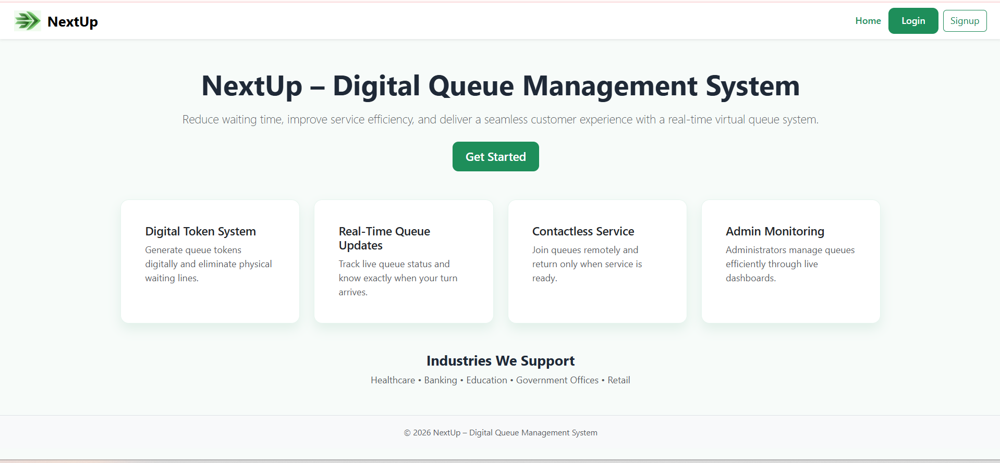
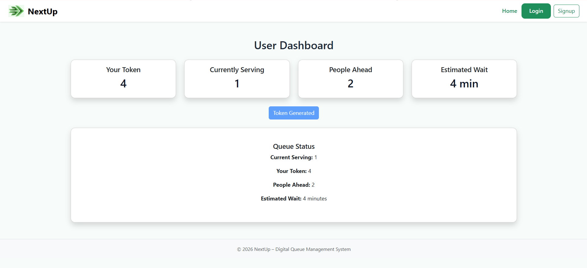
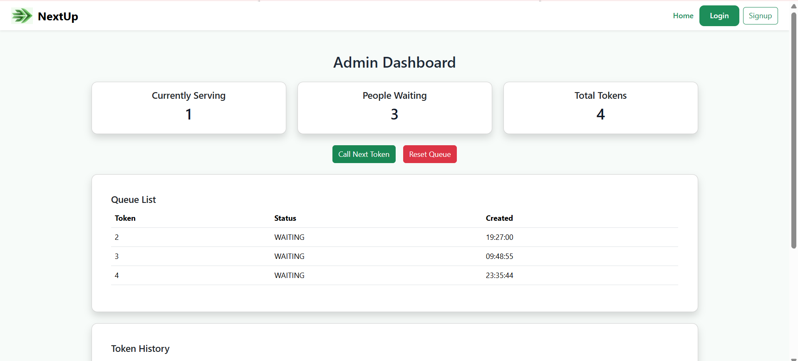
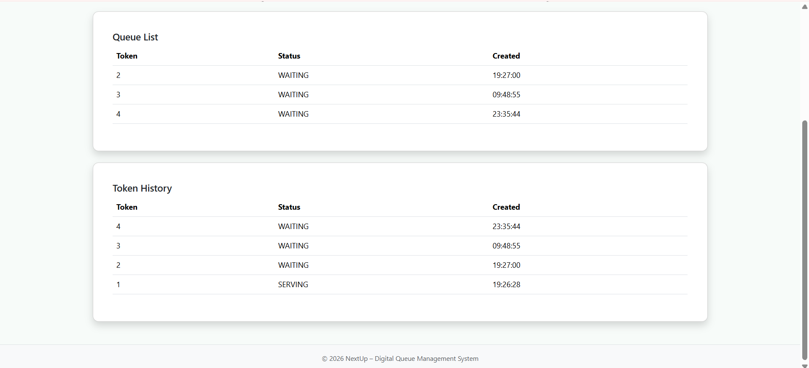

# NextUp – Digital Queue Management System

**NextUp** is a MERN stack-based web application that modernizes traditional queue systems by enabling users to generate virtual tokens and track queue status in real-time.

> *Skip the line, not your turn.*

---

## Features

* Generate virtual tokens online
* Real-time queue updates using Socket.IO
* User authentication (Login / Signup)
* Admin dashboard to manage queues
* Analytics for queue insights
* Responsive and clean UI

---

## Tech Stack

* **Frontend:** React.js, Vite, CSS
* **Backend:** Node.js, Express.js
* **Database:** MongoDB
* **Real-time:** Socket.IO

---

## Project Structure

NextUp/
├── frontend/
├── backend/
└── README.md

---

## Installation & Setup

### Clone the repository

git clone https://github.com/poorrrnimaaa/NextUp.git
cd NextUp

---

### Backend setup

cd backend
npm install
npm start

---

### Frontend setup

cd frontend
npm install
npm run dev

---

## Environment Variables

Create a `.env` file inside backend:

PORT=5000
MONGO_URI=your_mongodb_connection
JWT_SECRET=your_secret

---

## Screenshots

### Home Page

### User Dashboard

### Admin Dashboard

### Admin Analytics

---

## Future Improvements

* Email/SMS notifications
* AI-based wait time prediction
* Mobile app version

---

